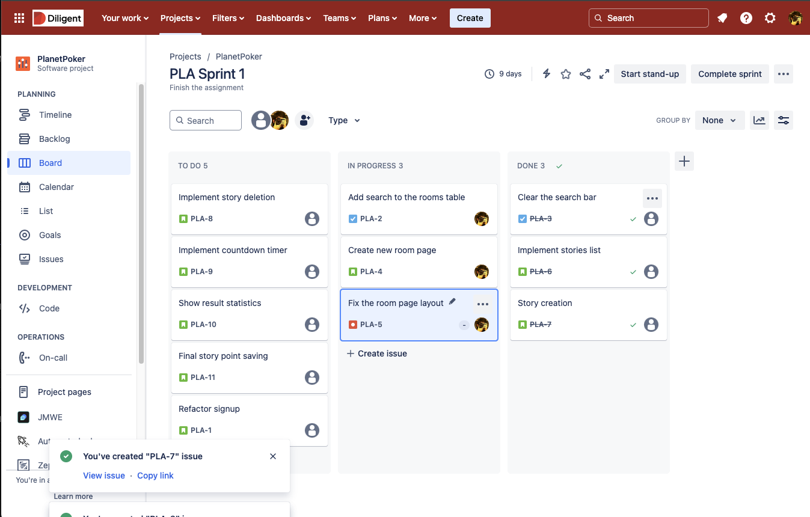

# Diligent Academy Final Assessments / Backend

## Submission requirements

Make sure to read the tasks carefully and think about the requirements and their optimal solutions, before starting the work.

You have to use `git` for version control and the solution has to be submitted over Github. The way you have used version control matters, the history of the project has to be understandable, so be sure to commit well and often. The usage of pull requests are not required.

## Introduction



Your task is to create an application backend for Diligent, called ✨Drillo✨. Drillo is a project management web application, similar to [Trello](https://trello.com/hu) and [JIRA](https://www.atlassian.com/software/jira). It is used by project managers to track their or their team’s work.
Trello and Jira consist of some main parts:

1. **_Boards_**
2. A board have different **_statuses_** (columns)
3. There are **_tickets_** in the board in different statuses
4. **_Backlog_**, this is a collection of the tickets that are not assigned to any column.

Users can manage tickets, boards, columns:

- The board can be created, edited and deleted by the project managers to represent the projects they are managing.
- To track the work, each board can have multiple columns, each column can contain multiple tickets represents the state of the work items it contains.
- New tickets, and tickets which aren’t added to any columns (don’t have a status) are automatically shown in the board’s backlog.
- Tickets can be moved between each column to track the work, by assigning it a status.
- Manager can delete or create statuses for the boards (including the default ones)
- Sprints can be created which are a collection of tickets, which have to be done within a predifined time period

## What you have so far

In this project, you can see a basic typescript application following hexagonal architecture.

- There are some packages that needs installation before running the application.

```sh
npm install
```

- OpenAPI specification can be found `backend/src/openapi-spec/openapi-spec.yml`. You can generate types from the OpenApi spec, this serves validation purposes in this case.
  To check the given endpoints, it is easier to digest if you use an online tool like https://editor.swagger.io/ and import the .yml file.
  You can also import this to a postman client so you can use it for manual testing and sendind requests.

```sh
npm run gentypes
```

- For validation, purposes we use [Zod](https://zod.dev/)
- Fastify is used as the web framework. The web server is listening on http://localhost:3000 after running it with the following command.

```sh
npm run dev
```

- API endpoints are created for the Board related operations

  - get all boards
  - get board by id
  - create board
  - update board
  - delete board (soft delete)

- SQL database engine is [SQLite](https://www.sqlite.org/about.html)
  - path is backend/database.sqlite
  - if you use Visual Studio Code, I recommend the [Database Client](https://marketplace.visualstudio.com/items?itemName=cweijan.vscode-database-client2) extension, you can connect to SQLite databases by providing the full path of the database.
  - By default there are 4 boards in the application, each have 3 statuses assigned to them by default
  - To initialize your DB, run the following command.

```sh
  npm run init-db
```

`Board table`

| Name        | Type      | Description                                                  |
| ----------- | --------- | ------------------------------------------------------------ |
| id          | integer   | Primary key for Board table, autoincrement                   |
| name        | text      | Name of the board, unique, mandatory                         |
| description | text      | Optional description for the board                           |
| created_at  | timestamp | Timestamp of the creation date and time                      |
| updated_at  | timestamp | Timestamp of the last update date and time                   |
| deleted_at  | timestamp | Timestamp of the deletion date and time, null if not deleted |

`Status table`

| Name       | Type      | Description                                                  |
| ---------- | --------- | ------------------------------------------------------------ |
| id         | integer   | Primary key for Status table, autoincrement                  |
| name       | text      | Name of the status, unique for a board                       |
| board_id   | integer   | Foreign key referencing the Board table                      |
| position   | integer   | Position of the status in the given board                    |
| created_at | timestamp | Timestamp of the creation date and time                      |
| updated_at | timestamp | Timestamp of the last update date and time                   |
| deleted_at | timestamp | Timestamp of the deletion date and time, null if not deleted |

> Please feel free to change this application by adding packages, configure formatter, etc. You also don't need to care about User management / Authentication / Authorization in this assessment. You can feely use AI to explain code or concepts, but please avoid generating code for the tasks, since it can generate funny things and more importantly: we are interested in _your_ knowledge.

You can now check the TASKS.md file!
