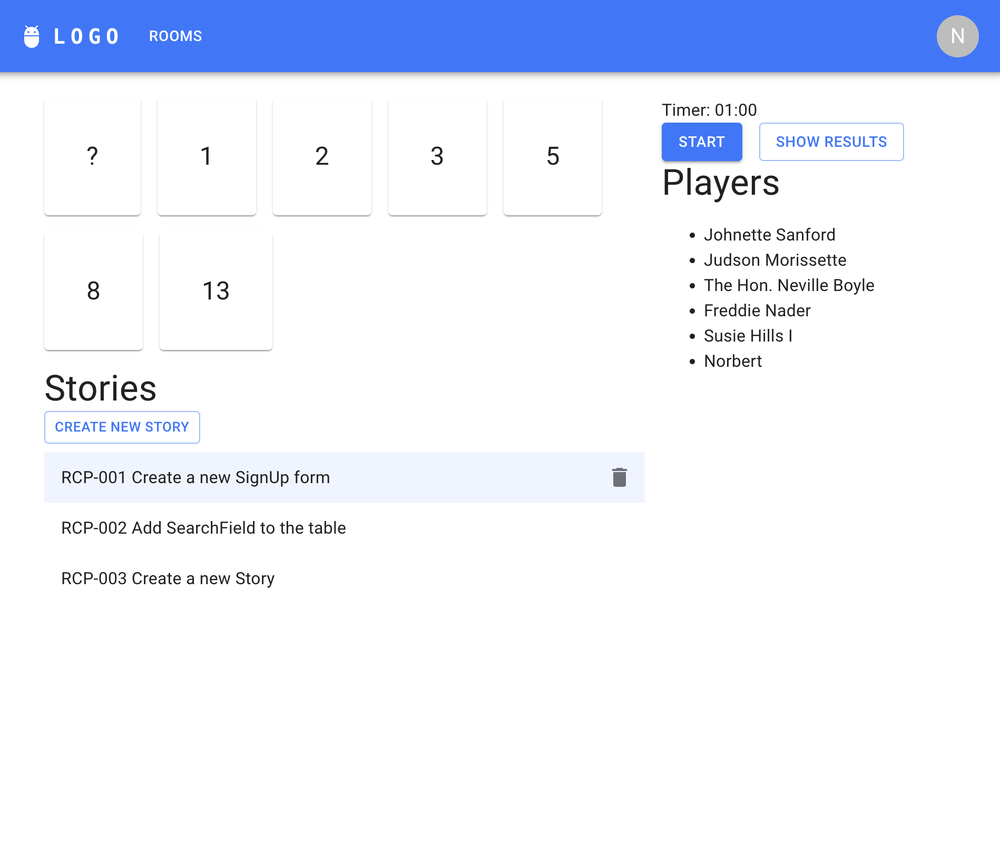

# Diligent Academy Final Assessment / Frontend

## Submission requirements
Make sure to read the tasks carefully and think about the requirements and their optimal solutions, before starting the work.

You have to use `git` for version control and the solution has to be submitted over Github. The way you have used version control matters, the history of the project has to be understandable, so be sure to commit well and often. The usage of pull requests are not required.

## Introduction

](./docs/planITpoker.png)

:earth_africa: **PlanetPoker** ✨ is an interactive planning poker application, inspired by [planIT poker](https://planitpoker.com/) which helps agile teams groom their stories. Each team member can vote on the current story, by picking their card on a grid.

Each card corresponds to the story's [story point](https://www.atlassian.com/agile/project-management/estimation) which is a complexity estimation by the team. The team has to arrive at a consensus, the tool helps to find this descision by allowing each member to vote separately. After a timer expires all votes are revealed, showing each member's own esitmation.

## Your tasks

You can find each of your tasks inside the [TASKS.md](TASKS.md) file.

## Development requirements

To start working on the code, you must install the following dependencies:

- Node.js v20.17.0
- Npm

## Development instructions

The application consists of a simple mocked backend and the frontend which you have to modify and extend.

Use:
1. `npm install` - to install all additional dependencies
2. `npm run backend` - to run the mocked backend
3. `cp .env.example .env` - to initialize the environment
> [!IMPORTANT]
> Open up a new terminal window to execute the last command
4.  `npm run dev` - to start the frontend development server
